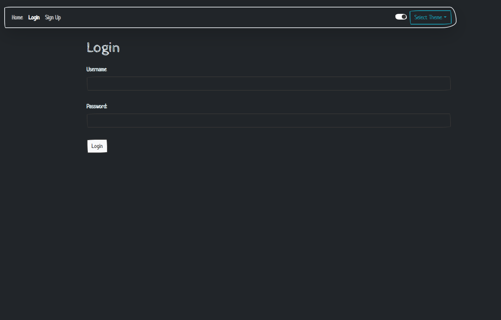
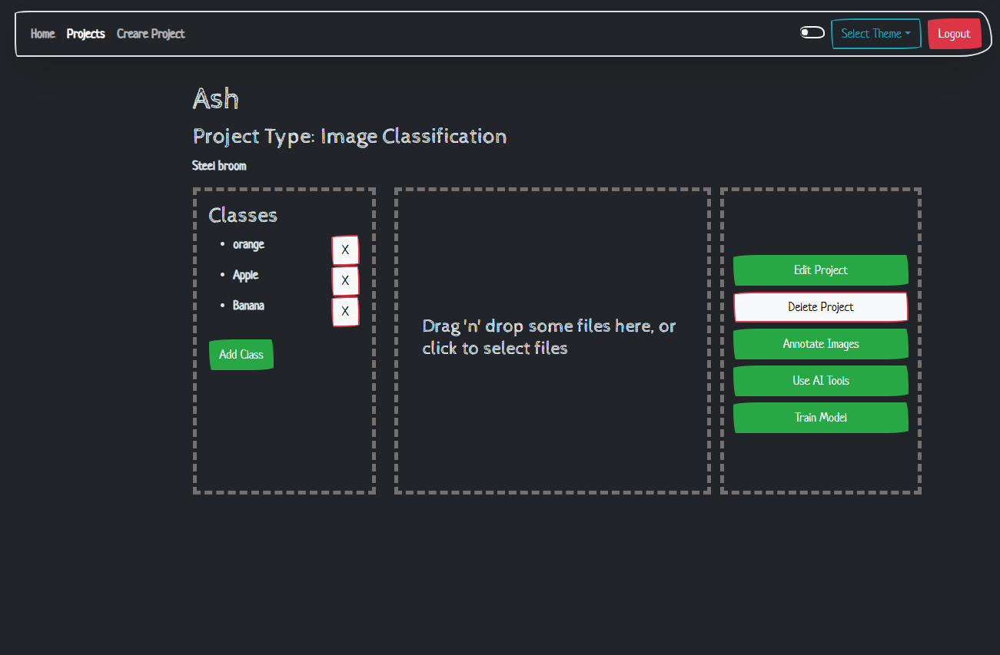

# Data Annotation App
This app design to help in generating a ground truth dataset for image detection system.

## Getting started
You need to run the backend [press here](https://github.com/aha1-lab/project-4-back-end)
and the frontend to get the system running

## Technologies used
### Frontend
- JavaScript
- React
- Bootstrap
- Dotenv

### Backend
- Flask
- SQLALCHAMEY
- Flask-mashmello
- Roboflow
- autodistill 
- autodistill-grounded-sam 
- autodistill-yolov8

## Next steps
1. Add extra control the the users and allow different type of user such as student or tutor.
2. Simplify the search using course code.
3. Add extra theam for light and drak mode. 
